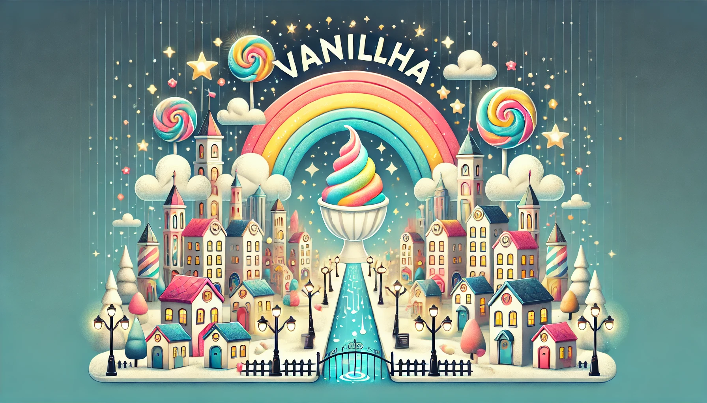

  

---

Era uma vez uma cidade mágica chamada Vanillha, onde as casas eram coloridas como doces, e as ruas, sempre limpinhas, pareciam um arco-íris. Os moradores de Vanillha eram muito criativos e adoravam inventar coisas novas, mas a cidade tinha alguns probleminhas que precisavam de solução.

Foi então que o prefeito da cidade, Mr. Martins, teve uma ideia brilhante, ele chamou a marsDev, uma empresa de tecnologia famosa por criar soluções mágicas e inovadoras. 

A marsDev enviou sua equipe mais especial, um grupo de inventores e programadores que falavam uma língua engraçada chamada JavaScript. Com muita paciência e criatividade, eles começaram a transformar Vanillha.

Primeiro, criaram o *Sinaleiro Amigável*, um sistema de semáforos inteligentes que conversavam uns com os outros para deixar o trânsito bem organizado. Depois, instalaram a *Lâmpada Encantada*, um sistema que regulava a luz das ruas para deixá-las mais brilhantes nas noites escuras e mais suaves quando havia luar.

E como não bastasse, criaram um aplicativo especial chamado *to-do vanilla*, onde os moradores podiam mandar mensagens para contar sobre qualquer probleminha que encontrassem na cidade.

  <h1>🌈 Invitation 🐇</h1>

Olá, explorador(a) de ideias e aprendiz de JavaScript! Não sei qual toca de coelho te trouxe até aqui, mas você está oficialmente convidado(a) a se juntar à nossa encantadora cidade de **Vanillha**!

Em Vanillha, acreditamos que o aprendizado é divertido e que cada um de nós pode fazer a diferença! Aqui, cada desafio é uma aventura e cada linha de código, um passo para resolver os desafios mágicos que encontramos.

#### Por que se tornar um Cidadão de Vanillha?

- Contribua com soluções, ideias e novas abordagens.
- Conheça outros habitantes que, assim como você, amam aprender e compartilhar.
- Ajude a construir uma cidade onde cada problema tem uma solução lógica e criativa.

#### Como se tornar um Cidadão?

Basta explorar nosso repositório [contributing.md](/contributing.md), deixar suas contribuições e interagir com outros membros. Seja enviando uma solução, sugerindo melhorias, ou criando novos desafios, você estará ajudando a cidade de Vanillha a crescer.

Venha conosco nessa jornada mágica e traga seu toque especial para nossa cidade! Estamos ansiosos para ver o que você pode criar. Vamos construir juntos uma Vanillha cheia de ideias brilhantes e descobertas.

---

Bem-vindo(a) a Vanillha! 🌈✨ Feito com 🩵 by Martins 🖖